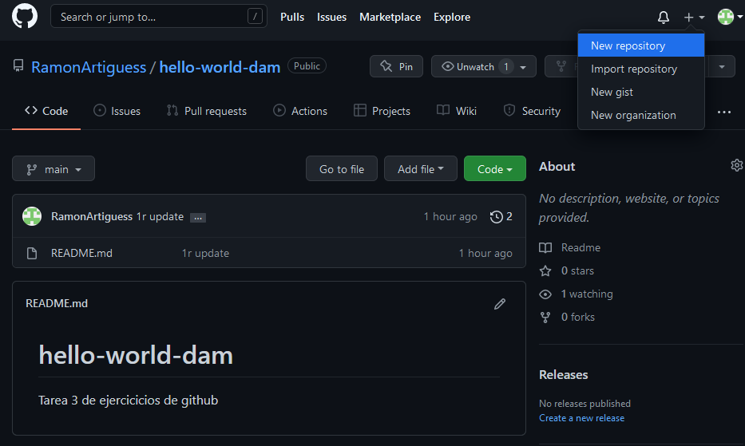
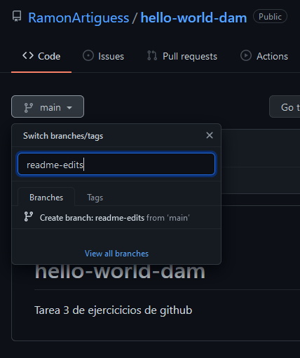
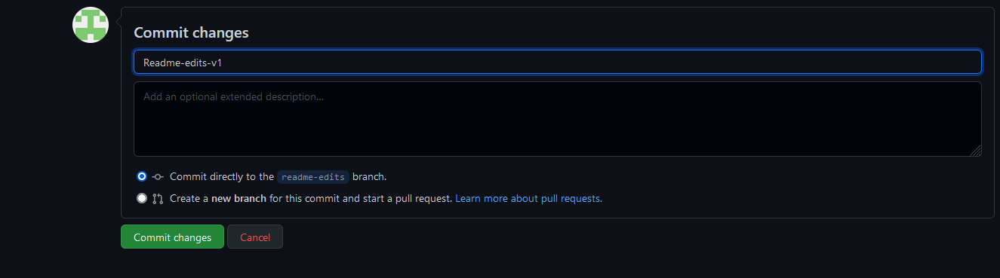
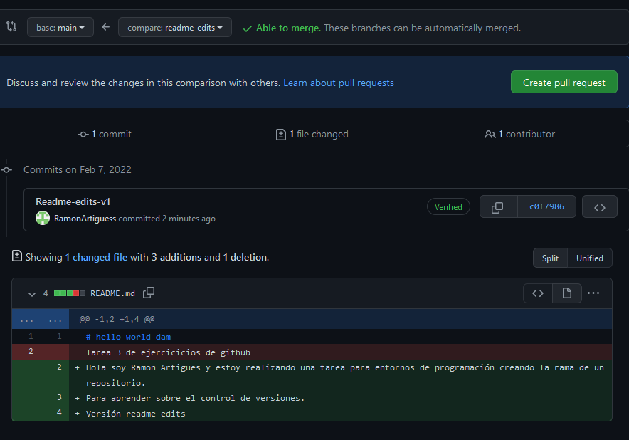
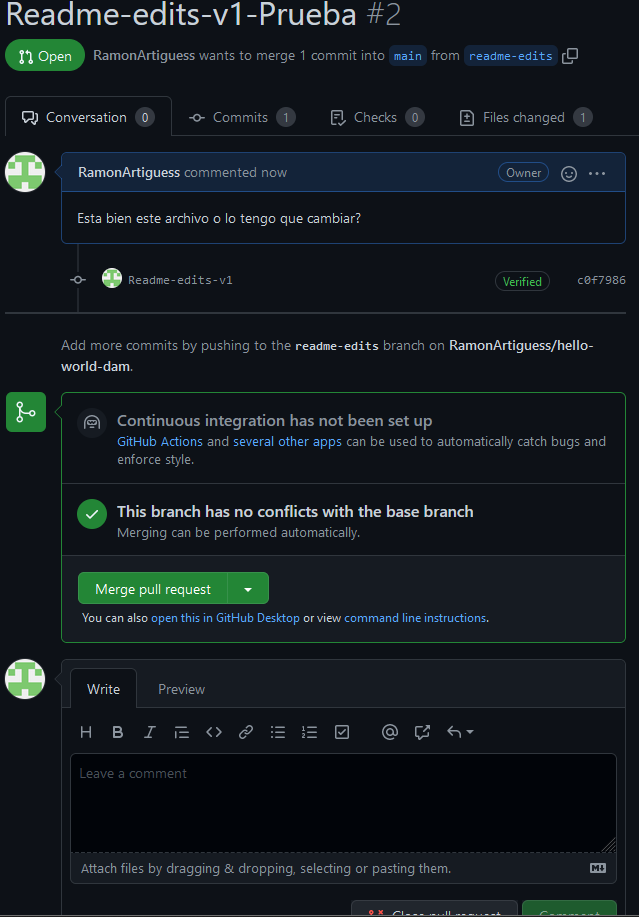
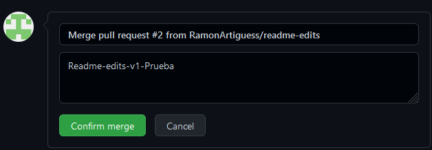

# hello-world-dam
Hola soy Ramon Artigues y estoy realizando una tarea para entornos de programación creando la rama de un repositorio.
Para aprender sobre el control de versiones.
Versión readme-edits

Lo primero sera crear el proyecto 

Despues de crear el proyecto tenemos que crear nuestra ram que se llama readme-edits.

Una vez creada la rama con el archivo Readme que teniamos previament creado en la rama main lo editamos y comentamos los cambios en la rama readme-edits.

Una vez echo tenemos crear una pull request, es pull se utiliza para poder comentar cambios que haremos en la rama principal o tras ramas para poderlo estudiar en equipo, simplemente vamos a la barra de navegación de arriba, clicamos sobre pull request i ahi comparamos las ramas.

Una vez echo esto se nos abre una especie de hilo de twitter :joy: , alli podemos debatir sobre si subir los archivos a esa rama

Una vez discutidos si esos cambios se pueden subir y en haver sido aprovados, podemos hacer una merge pull request que seria implementar los cambios. Clicamos encima de merge pull request i añadimos un comentario i ya estarian los cambios añadidos a la rama principal o la rama donde queriamos subir los archivos.

